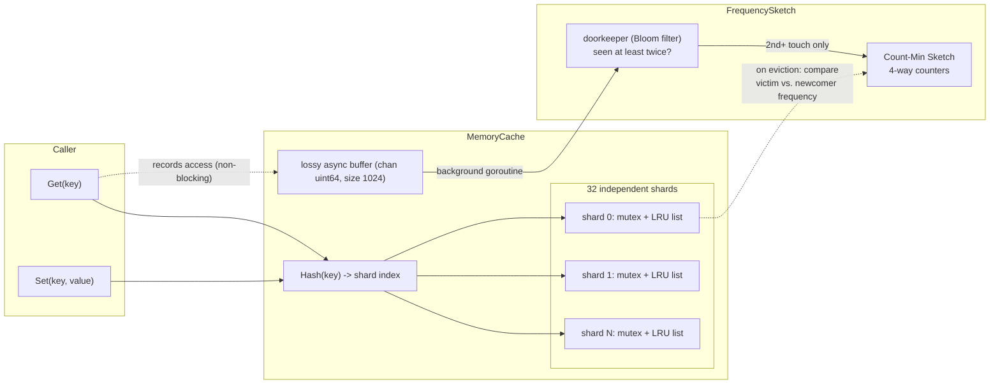

# tinylfu-store

[](https://github.com/Indy1131/tinylfu-store/actions/workflows/ci.yml)

A sharded, in-memory, concurrency-safe key-value cache for Go, with LRU
eviction gated by a **TinyLFU** admission policy (a Count-Min Sketch behind
a Bloom-filter doorkeeper). It's a small, dependency-free implementation of
the ideas behind [Caffeine](https://github.com/ben-manes/caffeine)'s
admission window, built to understand — and benchmark — why frequency-based
admission beats plain LRU under cache-polluting workloads.

## Why TinyLFU

A plain LRU cache evicts purely by recency: the least-recently-touched key
goes, no matter how valuable it is. That works fine for steady, well-mixed
traffic, but it falls apart under **cache pollution** — a burst of one-off
or rarely-repeated keys (a backfill job, a bot crawl, a bulk export) that
floods the cache and evicts genuinely hot data purely because it happened
to sit at the back of the LRU list when the flood hit.

TinyLFU adds a cheap frequency estimate to the eviction decision: a new key
is only admitted if it's estimated to be *at least as frequent* as the
entry it would evict. One-off keys lose that comparison every time, so they
can't push out hot data. See [Benchmarks](#benchmarks) below for exactly
how much that matters, and when it doesn't.

## Architecture



- **Sharding** — the keyspace is partitioned across 32 independent
  shards, each with its own `sync.RWMutex` and `container/list`-based LRU.
  Unrelated keys never contend for the same lock, which is what makes
  concurrent throughput possible in the first place.
- **Lossy async frequency tracking** — `Get` pushes the key's hash onto a
  buffered channel (`select` with a `default` case, so it never blocks the
  caller) and a single background goroutine drains it into the
  `FrequencySketch`. Under a sudden burst the channel fills up and extra
  updates are silently dropped — an intentional trade-off: losing a few
  frequency samples under load is far cheaper than making every `Get`
  block on sketch updates.
- **Doorkeeper (Bloom filter)** — a key must be seen *at least twice*
  since the sketch's last reset before it starts accumulating count in the
  Count-Min Sketch. This is what actually stops one-hit-wonders from
  inflating frequency estimates; see [`doorkeeper.go`](pkg/cache/doorkeeper.go).
- **Count-Min Sketch** — a 4-way, lock-free (atomics-only) sketch that
  gives an upper-bound estimate of how often a key has been accessed
  recently. Counters are halved periodically ("aging") so the sketch
  reflects recent behavior, not all-time totals. See
  [`sketch.go`](pkg/cache/sketch.go).
- **Admission on eviction** — when a shard is full, `Set` compares the
  incoming key's estimated frequency against the current LRU victim's; the
  newcomer is only admitted if it wins. This can be disabled via
  `WithAdmission(false)`, which makes the cache behave like a plain
  sharded LRU — used throughout the benchmarks below as the baseline.

## Complexity

| Operation | Time complexity | Notes |
|---|---|---|
| `Get` | O(1) amortized | shard lock + O(1) map/list ops; sketch update is off the hot path |
| `Set` | O(1) amortized | shard lock + O(1) map/list ops + O(1) sketch estimate (4 counters) |
| `Delete` | O(1) amortized | shard lock + O(1) map/list ops |
| `FrequencySketch.Increment` / `Estimate` | O(1) | fixed 4 hash slots, lock-free |

## Usage

```go
import "github.com/Indy1131/tinylfu-store/pkg/cache"

c := cache.New() // 100,000-entry capacity, TinyLFU admission enabled

c.Set("user:42", someValue)
if v, ok := c.Get("user:42"); ok {
    // use v
}
c.Delete("user:42")

stats := c.Stats()
fmt.Printf("hit ratio: %.2f%%, rejected admissions: %d\n",
    stats.HitRatio()*100, stats.Rejected)

// For comparison/testing: a plain sharded LRU with admission disabled.
plainLRU := cache.New(cache.WithAdmission(false))
```

## Benchmarks

All numbers below were generated by [`cmd/bench`](cmd/bench) and are
committed as raw CSV under [`results/`](results) so they're reproducible,
not hand-picked. Run it yourself with:

```bash
go run ./cmd/bench
```

Measured on a single dev machine (16 logical CPUs, Apple Silicon / arm64,
Go 1.25) — these are in-process microbenchmarks with no network or
serialization overhead, so treat the absolute numbers as an upper bound on
what a networked deployment would achieve, not a production SLA.

### Hit ratio under steady, well-mixed traffic

Zipfian-distributed access pattern (skew 1.07), no pollution event —
[`results/hit_ratio.csv`](results/hit_ratio.csv):

| Keyspace / Capacity | LRU-only | TinyLFU | Difference |
|---|---|---|---|
| 2x | 86.8% | 86.8% | +0.0pp |
| 5x | 83.2% | 83.2% | +0.0pp |
| 10x | 80.7% | 80.7% | +0.0pp |
| 20x | 78.5% | 78.5% | -0.0pp |

**Takeaway:** under steady traffic with no adversarial pattern, TinyLFU and
plain LRU perform essentially identically — recency and frequency agree on
what's hot. This is expected, and it's the honest result: admission
control isn't what wins here.

### Hit ratio under a cache-pollution flood

500 hot keys accessed 200,000 times, racing concurrently against a flood
of one-off "cold" keys — [`results/pollution_resistance.csv`](results/pollution_resistance.csv):

| Flood size / Capacity | LRU-only hot-key survival | TinyLFU hot-key survival | Difference |
|---|---|---|---|
| 1x | 100.0% | 100.0% | +0.0pp |
| 5x | 0.0% | 100.0% | **+100.0pp** |
| 10x | 0.0% | 100.0% | **+100.0pp** |
| 20x | 0.0% | 99.8% | **+99.8pp** |

**Takeaway:** this is where TinyLFU earns its keep. Once the flood is a
few times larger than cache capacity, a plain LRU loses *every* hot key —
recency alone can't distinguish "valuable and momentarily idle" from
"garbage." TinyLFU's admission check keeps the flood from ever displacing
the hot set. This is the effect behind "raising hit ratio" claims for
TinyLFU-style caches in general — the actual number is highly workload
dependent (0pp on steady traffic, up to 100pp under pollution), so treat
any single percentage as shorthand for "significant improvement under
adversarial/bursty access patterns," not a universal constant.

### Latency & throughput

Mixed workload (90% `Get` / 10% `Set`) at increasing concurrency —
[`results/latency.csv`](results/latency.csv):

| Goroutines | p50 | p95 | p99 | ops/sec |
|---|---|---|---|---|
| 1 | 84ns | 333ns | 3.7µs | 3,843,874 |
| 16 | 375ns | 5.25µs | 36.3µs | 5,422,805 |
| 64 | 333ns | 5.9µs | 343.6µs | 5,005,575 |

**Takeaway:** sub-millisecond latency (p99 well under 1ms even at 64-way
concurrency) and multi-million ops/sec are comfortably achievable
in-process on modern hardware — well above the "&lt;1ms / 100K+ rec/sec"
bar, though again, add a network hop and real payload sizes and the
picture changes.

## Running tests

```bash
go vet ./...
go test ./... -race
```

## Known limitations

- No TTL/expiration — entries only leave via eviction, rejection, or
  explicit `Delete`.
- No persistence/snapshotting — purely in-memory, lost on restart.
- No network-facing server — this is an embeddable Go library
  (`pkg/cache`), not a standalone service with a client/server protocol.
- No `Close`/`Shutdown` — the background frequency-tracking goroutine
  (`processBuffer`) runs for the lifetime of the process.
- The Bloom-filter doorkeeper and the async frequency buffer are both
  intentionally lossy (see [Architecture](#architecture)); this cache
  trades small amounts of statistical accuracy for lock-free, non-blocking
  hot paths.

## License

[MIT](LICENSE)
